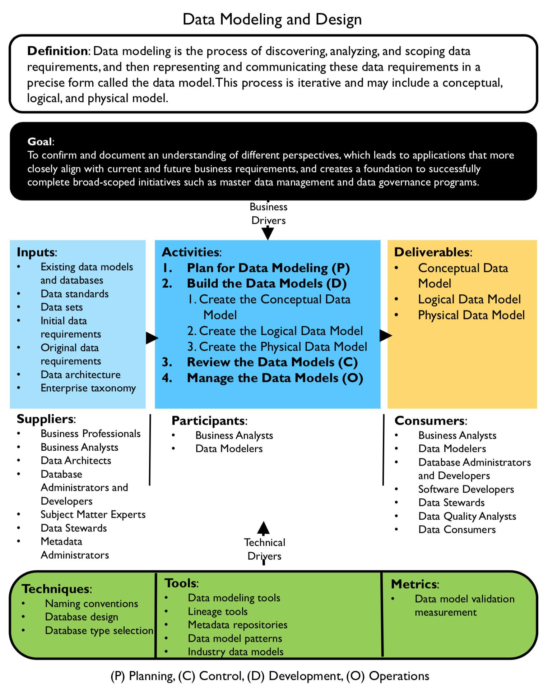

# 数据建模与设计（Data Modeling & Design）

## Perspective

### 概念模型（Conceptual Data Model）

以数据实体及其之间的关系为基本构成单元的模型，实体名称一般采用标准的业务术语命名

### 逻辑模型（Logical Data Model）

在概念模型基础上细化，以数据属性为基本构成单元

### 物理模型（Physical Data Model）

逻辑模型在计算机信息系统中依托于特定实现工具的数据结构

### 主题域模型（Subject Domain Model）

以主题概念及其之间的关系为基本构成单元的模型，主题是对数据事物本事概念的高度抽象

## Methodology

### 关系模型（Relational Model）

- Entity（实体）
- Relationship（关系）
- 3NF

> 1NF：属性（列）具有原子性，不可再分 
> 2NF：记录（行）具有惟一性，主键外属性只依赖于主键，没有部分依赖 
> 3NF：属性没有冗余，属性不依赖于其它非主属性，没有传递依赖

### 维度模型（Dimensional Model）

- 事实（Fact）
- 维度（Dimension）

> 星形模型（Star Schema） 
> 雪花模型（Snowflake Schema）

### Data Vault

- Hub（核心实体/事实）
- Link（关联关系）
- Satellite（从属实体/事实）

### Anchor

- Anchors（核心实体/事实）
- Ties（关联关系）
- Attributes（从属实体/事实）
- Knots（维度/码值）

## Benefit

- 质量
- 成本
- 性能
- 效率

## Reference

- [The book of data warehouse](https://github.com/dantezhao/data-warehouse)
- [数据仓库（张子良）](https://www.cnblogs.com/hadoopdev/category/651905.html)