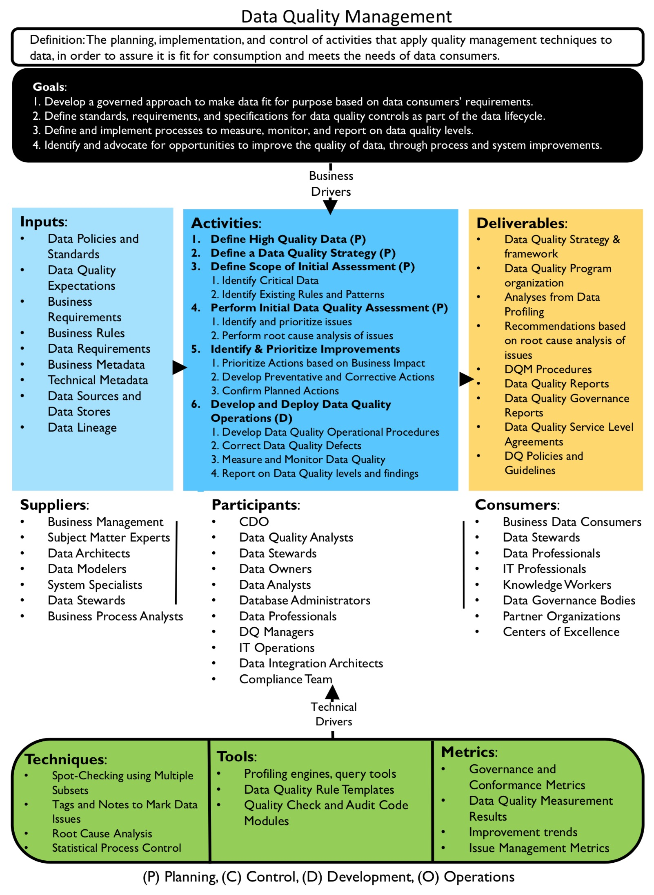

# 数据质量（Data Quality）

## Measure Model

### Accuracy（准确性）

Do data objects accurately represent the “real-world” values they are expected to model?

Incorrect attribute of selling items across several systems can impact operational and analytical applications. 

方案：对比数据是否一致，通过维度约减、数据范围及数据分组提升性能

### Profiling（统计信息）

Apply statistical analysis and assessment of data values within a dataset for consistency, uniqueness and logic

方案：对数据基础信息进行统计分析，值域、长度、计数、基数、频率、空值率、直方图等

### Completeness（完整性）

Is all necessary data present

方案：检查数据的完整性，基于统计信息或是文件元数据

相关：异常值、元数据、链路

### Timeliness（实效性）

Is the data available at the time needed

方案：基于文件、数据、任务时间等

相关：SLA、优先级

### Anomaly detection（异常检测）

Pre-built algorithm functions for the identification of items, events or observations which do not conform to an expected pattern or other items in a dataset

方案：基于统计信息、异常检测、时间序列分析等

相关：空值、基数、波动

### Validity（有效性）

Are all data values within the data domains specified by the business

方案：基于统计信息、自定义规则或函数

相关：范围、波动、极值、均值、方差、特殊字符与乱码

## Reference

- [Apache Griffin: Big Data Quality Solution For Batch and Streaming](http://griffin.apache.org)