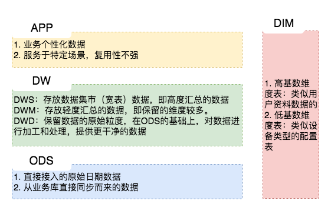

# 数据仓库与商业智能（Data Warehousing & Business Intelligence）

## 数据仓库 

面向主题的、集成的、随时间变化的、非易失的数据集合，用于支持管理者的决策过程

## 架构（Architecture）

- 独立数据集市架构（Independent data mart architecture）：信息孤岛问题
- 联邦数据仓库架构（Federated data warehouse architecture）：数据不一致问题
- 集中架构（Centralized architecture）：EDW
- 集线架构（Hub architecture）：CDW、Hub、CIF
- 总线架构（Bus architecture）：DMR、Bus、SOA
- 复合架构（Composite architecture）：上层采用 Hub，下层采用 Bus

## 设计（Design）

总结：面向业务及数据使用 ER模型，面向需求及分析使用 维度模型

- Inmon：CIF，3NF、ER

优势：数据是集成的、整合的；业务实体及流程描述清晰；灵活，能适应变化；冗余低，ETL加工明确，可以避免更新异常；
缺点：调研、建模、实现、使用复杂；交付周期长；需要建立数据集市，使用更多存储和计算；

- Kimball：Bus，Fact、Dimension

优势：星型模型，快速建模、实现、交付；符合数据库、OLAP特性，性能好；一致维度和指标，便于分析和考核
缺点：依赖多个事实，使得就绪延迟；冗余数据，使得更新困难；只能支持部分业务及需求，扩展会变得越来越复杂；

- Data Vault：4NF
- Anchor：6NF

## 分层（Layer）

- 清晰数据结构：每一个数据分层都有它的作用域和职责，在使用表的时候能更方便地定位和理解
- 减少重复开发：规范数据分层，开发一些通用的中间层数据，能够减少极大的重复计算
- 统一数据口径：通过数据分层，提供统一的数据出口，统一对外输出的数据口径
- 复杂问题简单化：将一个复杂的任务分解成多个步骤来完成，每一层解决特定的问题

### Source / Stage

### ODS(Operational Data Store)

### DW(Data Warehouse)

- DWD(Data Warehouse Detail)

- DWM(Data Warehouse Middle)

- DWS / DM(Data Warehouse Service / Data Mart)

### Fact

- 对业务过程事件的度量，基本通过数值表示，与声明的粒度保持一致
- 可加、半可加、不可加

### DIM(Dimension)

- 层次维度
- 退化维度
- 合并维度
- 分段维度

**基数（Cardinality）**

- 高基数（High Cardinality）：用户、设备
- 低基数（Low Cardinality）：城市、配置

### APP(Application)

## Lifecycle

## Practice

- 明确分层的职责、边界、关系，明确模型的粒度、维度、事实
- 底层基于数据，进行关系建模，上层基于业务，进行维度建模
- 业务抽象、数据整合，避免不同数据口径带来的一致性问题
- 非整合层次依赖于整合数据，禁止跨层依赖、禁止反向依赖

### Design Patterns

用设计模式原则的视角看待数仓模型设计

- 开闭原则(Open Closed Principle)：对扩展开放，对修改关闭

    对于变化进行扩展，对于稳定进行抽象

- 里氏替换原则(Liskov Substitution Principle)：保持原始，扩展变化

    保持原始行为，扩展变化行为（开闭原则的一个实例）

- 依赖倒置原则(Dependence Inversion Principle)：不依赖于细节，而依赖于抽象

    实现依赖于抽象，实现的关系依赖于抽象的关系；物理模型 -> 逻辑模型 -> 概念模型/领域模型 -> 业务模型

- 迪米特法则(Law of Demeter)：低耦合，高内聚

- 单一职责原则(Single Responsibility Principle)：职责简单明确

- 接口隔离原则(Interface Segregation Principle)：依赖简单明确

## Reference

- [The book of data warehouse](https://github.com/dantezhao/data-warehouse)
- [数据仓库（张子良）](https://www.cnblogs.com/hadoopdev/category/651905.html)
- [谈谈数据仓库架构的发展和分类](https://groups.google.com/forum/#!topic/ttnn/na-Fmm8QHNI/discussion)
- [Kimball DW/BI Lifecycle Methodology](https://www.kimballgroup.com/data-warehouse-business-intelligence-resources/kimball-techniques/dw-bi-lifecycle-method/)